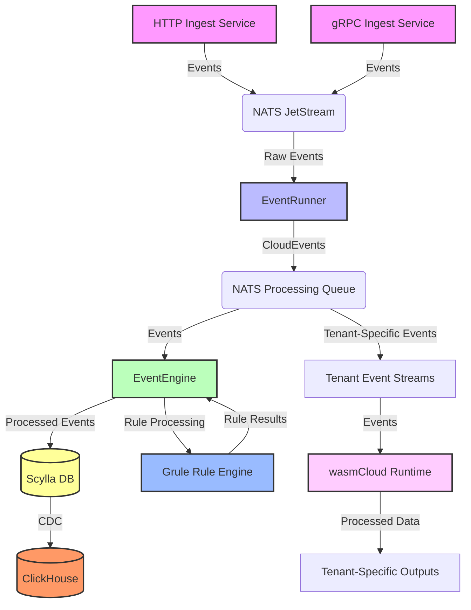

# eventrunner

[](https://github.com/carverauto/eventrunner/actions/workflows/golangci-lint.yml)

## High-Throughput Event Processing Engine

This project implements a high-speed, high-throughput event processing engine backed by Cassandra (Scylla) 
and NATS JetStream. It's designed to handle large volumes of events in real-time, with flexible processing 
capabilities and robust data storage.



## Components

**Ingest Services:** HTTP and gRPC services that accept incoming events.

**NATS JetStream**: High-performance message broker for event ingestion and distribution.

**EventRunner**: Service that processes raw events, converts them to CloudEvents if necessary, and queues them for processing.

**EventEngine**: Core processing component that applies business logic to events.

**Grule Rule Engine**: RETE-enabled rule engine for flexible, high-performance event processing.

**Scylla DB**: Cassandra-compatible NoSQL database used as the primary data sink.

**ClickHouse**: Column-oriented DBMS for real-time analytics, fed by Scylla's Change Data Capture (CDC).

**Tenant Event Streams**: NATS JetStream subjects for tenant-specific event distribution.

**wasmCloud Runtime**: Secure runtime environment for executing WebAssembly modules as tenant-specific event consumers.

## Key Features

* High-throughput event ingestion via HTTP and gRPC
* Scalable event processing using NATS JetStream
* Flexible event transformation and routing with EventRunner
* Powerful rule-based processing using the Grule Rule Engine
* Durable storage with Scylla DB
* Real-time analytics capabilities with ClickHouse
* Tenant-specific event streaming and processing
* Secure, polyglot event consumer execution using WebAssembly and wasmCloud

## Event Streaming for Consumers
Consumers can listen to tenant-specific event streams using NATS JetStream subjects. Each tenant is assigned a unique subject, allowing for isolated and secure event consumption.

To consume events:

1. Authenticate with the event-ingest service using your tenant credentials.
2. Process incoming events according to your business logic.

## WebAssembly Integration with wasmCloud

Our system supports the creation and execution of polyglot WebAssembly (WASM) applications as event consumers using wasmCloud. This allows you to write event processing logic in various languages and run it in a secure, sandboxed environment.

### Creating a WASM Event Consumer

1. Write your event consumer logic in your preferred language (e.g., Rust, Go, AssemblyScript).
2. Compile your code to WebAssembly targeting the wasmCloud ABI.
3. Sign your WASM module with the appropriate capabilities for event processing.

```rust
use wasmbus_rpc::actor::prelude::*;
use wasmcloud_interface_messaging::*;

#[derive(Actor, MessageDispatch)]
#[services(Actor, MessageSubscriber)]
struct EventConsumer;

#[async_trait]
impl MessageSubscriber for EventConsumer {
    async fn handle_message(&self, ctx: &Context, msg: &DeliverMessage) -> RpcResult<()> {
        // Process the event
        println!("Received event: {:?}", msg.body);
        Ok(())
    }
}
```

### Deploying WASM Consumers

1. Upload your signed WASM module to the wasmCloud control interface.
2. Configure the necessary links to connect your module to the NATS event stream.
3. Start your WASM module, which will begin consuming events from your tenant-specific subject.

The wasmCloud runtime ensures that your Wasm modules run in a secure, isolated environment with controlled access to resources.

#### Security Considerations

* Tenant isolation is enforced through NATS subject naming and authentication.
* WASM modules run in sandboxed environments with limited capabilities.
* All communication between components is encrypted and authenticated.

## Getting Started

## Configuration

## Usage

## Contributing

## License

Apache 2.0
