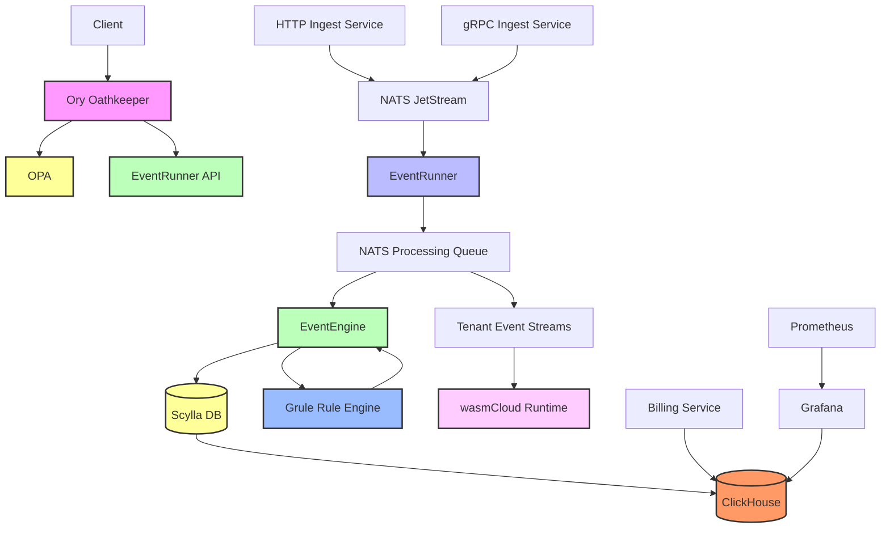

# EventRunner

[](https://github.com/carverauto/eventrunner/actions/workflows/golangci-lint.yml)

## High-Throughput Event Processing Engine with Advanced Authorization and Billing

EventRunner is a high-speed, high-throughput event processing engine designed to handle large volumes of events in real-time. It features flexible processing capabilities, robust data storage, tenant-specific event consumers using WebAssembly, and a comprehensive billing system.

## Architecture Overview



## Components

1. **Ory Oathkeeper**: API Gateway handling authentication and authorization, integrated with OPA.
2. **Open Policy Agent (OPA)**: Provides fine-grained authorization decisions.
3. **EventRunner API**: Core API for managing the event processing system.
4. **Ingest Services**: HTTP and gRPC services for event ingestion.
5. **NATS JetStream**: High-performance message broker for event distribution.
6. **EventRunner**: Processes raw events and converts them to CloudEvents.
7. **EventEngine**: Applies business logic to events.
8. **Grule Rule Engine**: RETE-enabled rule engine for flexible event processing.
9. **Scylla DB**: Primary data storage for processed events.
10. **ClickHouse**: Column-oriented DBMS for real-time analytics and billing data.
11. **wasmCloud Runtime**: Executes WebAssembly modules as tenant-specific event consumers.
12. **Billing Service**: Manages resource usage tracking and invoice generation.
13. **Grafana**: Provides visualization for metrics and user-accessible dashboards.
14. **Prometheus**: Collects and stores metrics from various system components.

## Key Features

- High-throughput event ingestion via HTTP and gRPC
- Scalable event processing using NATS JetStream
- Flexible event transformation and routing
- Powerful rule-based processing using the Grule Rule Engine
- Durable storage with Scylla DB
- Real-time analytics and billing with ClickHouse
- Tenant-specific event streaming and processing
- Secure, polyglot event consumer execution using WebAssembly and wasmCloud
- Fine-grained access control with Open Policy Agent via Ory Oathkeeper
- Comprehensive billing and resource usage tracking

## Authentication and Authorization

EventRunner uses Ory Oathkeeper as the API Gateway, which integrates natively with Open Policy Agent (OPA) for fine-grained authorization decisions.

### Authorization Flow

1. Client sends a request to the API endpoint.
2. Ory Oathkeeper authenticates the request.
3. Oathkeeper consults OPA for an authorization decision.
4. If authorized, the request is forwarded to the appropriate EventRunner API service.
5. The API service handles the request, assuming it's already authorized.

### Ory Oathkeeper Configuration

```yaml
authorizers:
  opa:
    enabled: true
    config:
      url: http://opa:8181/v1/data/eventrunner/authz/allow
```

### OPA Policy Example

```rego
package eventrunner.authz

default allow = false

allow {
    is_authenticated
    has_permission
}

is_authenticated {
    input.subject.authenticated = true
}

has_permission {
    role := input.subject.roles[_]
    permissions := role_permissions[role]
    required_permission := required_permissions[input.resource][input.action]
    permissions[_] == required_permission
}

role_permissions = {
    "admin": ["read", "write", "delete"],
    "user": ["read"]
}

required_permissions = {
    "/api/v1/usage": {
        "GET": "read"
    },
    "/api/v1/billing": {
        "GET": "read",
        "POST": "write"
    }
}
```

## Billing and Resource Tracking

The billing system uses ClickHouse for storing and analyzing resource usage data.

### ClickHouse Schema

```sql
CREATE TABLE tenant_usage (
    tenant_id String,
    timestamp DateTime,
    cpu_usage Float64,
    memory_usage Float64,
    network_ingress Float64,
    network_egress Float64
) ENGINE = MergeTree()
ORDER BY (tenant_id, timestamp);
```

### Billing API

- `GET /api/v1/usage/{tenant-id}`: Retrieve usage data for a specific tenant
- `GET /api/v1/invoice/{tenant-id}`: Retrieve the latest invoice for a tenant
- `GET /api/v1/invoice/{tenant-id}/{invoice-id}`: Retrieve a specific invoice

## wasmCloud Integration

EventRunner supports the creation and execution of polyglot WebAssembly (Wasm) applications as event consumers using wasmCloud.

### Creating a Wasm Event Consumer

1. Write your event consumer logic in your preferred language (e.g., Rust, Go, AssemblyScript).
2. Compile your code to WebAssembly targeting the wasmCloud ABI.
3. Sign your Wasm module with the appropriate capabilities for event processing.

Example Rust code for a simple event consumer:

```rust
use wasmbus_rpc::actor::prelude::*;
use wasmcloud_interface_messaging::*;

#[derive(Actor, MessageDispatch)]
#[services(Actor, MessageSubscriber)]
struct EventConsumer;

#[async_trait]
impl MessageSubscriber for EventConsumer {
    async fn handle_message(&self, ctx: &Context, msg: &DeliverMessage) -> RpcResult<()> {
        // Process the event
        println!("Received event: {:?}", msg.body);
        Ok(())
    }
}
```

## Setup and Deployment

1. Deploy Ory Oathkeeper and configure OPA integration.
2. Set up NATS JetStream, Scylla DB, and ClickHouse.
3. Deploy the EventRunner API and associated services.
4. Configure Grafana dashboards with ClickHouse as a data source.
5. Set up the wasmCloud runtime for tenant-specific event processing.

Detailed deployment instructions can be found in the [Deployment Guide](./docs/deployment-guide.md).

## Usage

Refer to the [API Documentation](./docs/api-docs.md) for detailed information on using the EventRunner API.

For creating and deploying Wasm event consumers, see the [Wasm Developer Guide](./docs/wasm-dev-guide.md).

## Monitoring and Dashboards

Access Grafana dashboards through the EventRunner portal for:

1. System-wide metrics and performance
2. Tenant-specific resource usage and billing information
3. Event processing statistics and latency metrics

## Contributing

We welcome contributions to EventRunner! Please see [CONTRIBUTING.md](./CONTRIBUTING.md) for details on how to get started.

## License

EventRunner is licensed under the Apache License 2.0. See [LICENSE](./LICENSE) for the full license text.

