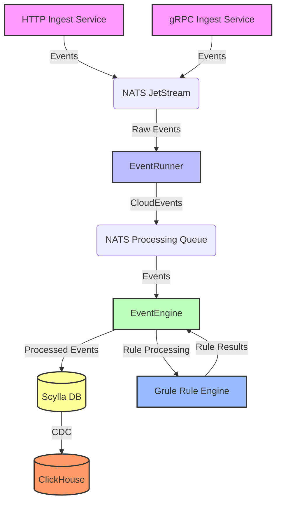

# eventrunner

## High-Throughput Event Processing Engine

This project implements a high-speed, high-throughput event processing engine backed by Cassandra (Scylla) 
and NATS JetStream. It's designed to handle large volumes of events in real-time, with flexible processing 
capabilities and robust data storage.

## Components

**Ingest Services:** HTTP and gRPC services that accept incoming events.

**NATS JetStream**: High-performance message broker for event ingestion and distribution.

**EventRunner**: Service that processes raw events, converts them to CloudEvents if necessary, and queues them for processing.

**EventEngine**: Core processing component that applies business logic to events.

**Grule Rule Engine**: RETE-enabled rule engine for flexible, high-performance event processing.

**Scylla DB**: Cassandra-compatible NoSQL database used as the primary data sink.

**ClickHouse**: Column-oriented DBMS for real-time analytics, fed by Scylla's Change Data Capture (CDC).

## Key Features

* High-throughput event ingestion via HTTP and gRPC
* Scalable event processing using NATS JetStream
* Flexible event transformation and routing with EventRunner
* Powerful rule-based processing using the Grule Rule Engine
* Durable storage with Scylla DB
* Real-time analytics capabilities with ClickHouse

## Getting Started

## Configuration

## Usage

## Contributing

## License

Apache 2.0