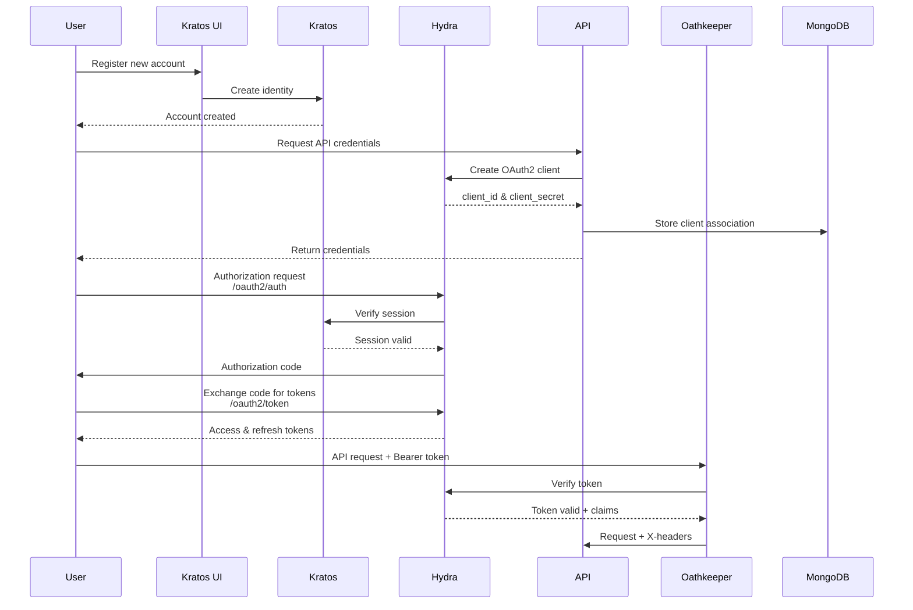
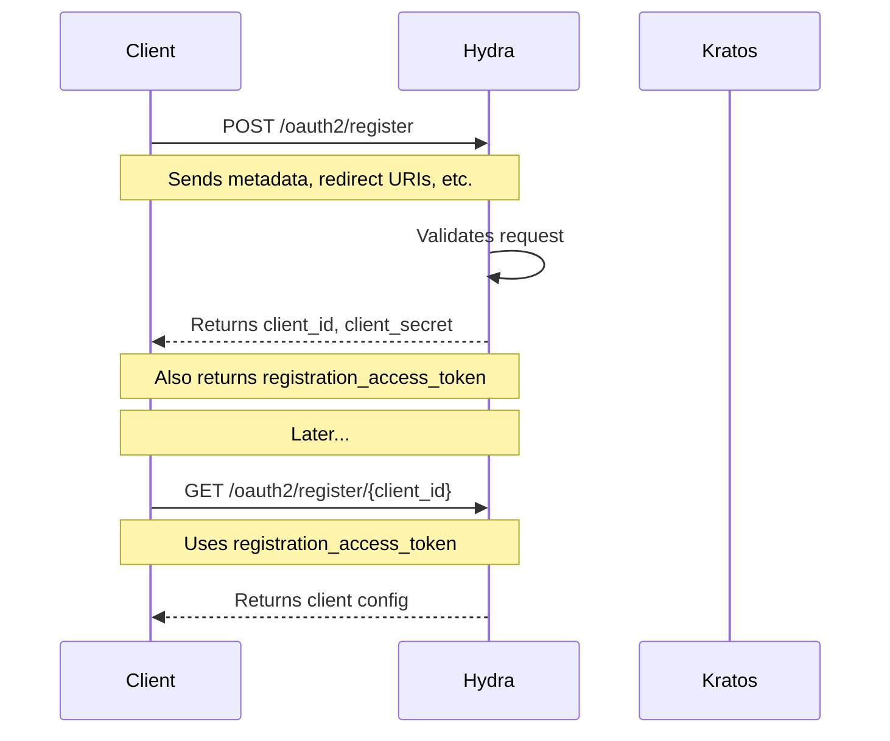

# EventRunner Authentication Flow

This document describes the authentication flow for the EventRunner platform, including user signup, API access, and OAuth2 token generation.

## Overview

EventRunner uses Ory's identity stack for authentication:
- Kratos: User management and authentication
- Hydra: OAuth2 provider
- Oathkeeper: API gateway and access control

## Flow Diagrams

### Overview


### User Registration Flow



## Step-by-Step Guide

### 1. User Registration

Users first register through the Kratos UI:
```
https://kratos.tunnel.threadr.ai/registration
```

### 2. Obtaining API Credentials

After registration, users can request API credentials:

```bash
# Create OAuth2 client in Hydra
curl -X POST http://hydra-admin.auth:4445/admin/clients \
  -H 'Content-Type: application/json' \
  -d '{
    "scope": "openid profile email tenant_id",
    "grant_types": ["authorization_code", "refresh_token", "client_credentials"],
    "response_types": ["code", "id_token"],
    "redirect_uris": ["https://api.tunnel.threadr.ai/callback"],
    "audience": ["https://api.tunnel.threadr.ai"]
  }'
```

### 3. OAuth2 Authorization Flow

#### 3.1 Generate Authorization URL

```bash
export CLIENT_ID="clientId"
export REDIRECT_URI="https://api.tunnel.threadr.ai/callback"

STATE=$(openssl rand -hex 16)
AUTH_URL="https://hydra.tunnel.threadr.ai/oauth2/auth?\
client_id=${CLIENT_ID}&\
response_type=code&\
scope=openid+profile+email+tenant_id&\
redirect_uri=https://api.tunnel.threadr.ai/callback&\
state=${STATE}"

echo $AUTH_URL
```

#### 3.2 Exchange Code for Tokens

After authorization, exchange the code for tokens:

```bash
curl -X POST https://hydra.tunnel.threadr.ai/oauth2/token \
  -H 'Content-Type: application/x-www-form-urlencoded' \
  --data-urlencode "grant_type=authorization_code" \
  --data-urlencode "code=${CODE}" \
  --data-urlencode "redirect_uri=https://api.tunnel.threadr.ai/callback" \
  --data-urlencode "client_id=${CLIENT_ID}" \
  --data-urlencode "client_secret=${CLIENT_SECRET}" \
  --data-urlencode "scope=openid profile email tenant_id"
```

### 4. Using the API

Use the access token in API requests:

```bash
curl -H "Authorization: Bearer ${ACCESS_TOKEN}" \
  https://api.tunnel.threadr.ai/api/resource
```

## Token Claims

The access token will include the following claims:
- `sub`: User ID
- `tenant_id`: User's tenant ID
- `scope`: Granted scopes
- Additional claims based on granted scopes (email, profile, etc.)

## Headers

Oathkeeper will transform the token claims into headers:
- `X-User-ID`: User ID from token subject
- `X-Tenant-ID`: Tenant ID from token claims
- `X-User-Email`: Email if scope includes email

## Security Considerations

1. Store client secrets securely
2. Use HTTPS for all requests
3. Validate state parameter
4. Implement token refresh logic
5. Set appropriate token expiration times

## Troubleshooting

Common issues and solutions:

1. Invalid redirect URI
    - Ensure the redirect URI matches exactly what's configured
    - Check for trailing slashes

2. Missing tenant ID
    - Verify metadata_admin is set in Kratos
    - Check consent code is including claims
    - Verify Oathkeeper configuration

3. Token validation failures
    - Check token expiration
    - Verify audience matches
    - Ensure required scopes are requested

## Reference

- [Ory Kratos Documentation](https://www.ory.sh/docs/kratos/concepts)
- [Ory Hydra Documentation](https://www.ory.sh/docs/hydra/concepts)
- [Ory Oathkeeper Documentation](https://www.ory.sh/docs/oathkeeper/concepts)