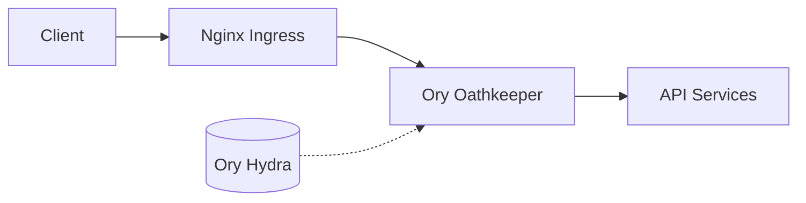

# auth

## Design

We will use Ory Kratos for identity management and Ory Hydra for OAuth2.0. 
A SuperUser is the first user created and has the ability to create other tenants and users.

## Identity

When we create an identity for the user, we will first create a tenant and then create the user. 
The tenant will have a unique ID that will be used to create the user. The user will have a unique ID 
that will be used to create the identity. We will set that tenantID and customerID in the user's traits,
and retrieve that in our app middleware for authorization.

Setting up Ory

### JWKS

Generate keys

```shell
openssl genpkey -algorithm RSA -out private_key.pem -pkeyopt rsa_keygen_bits:2048
openssl rsa -pubout -in private_key.pem -out public_key.pem
```

Use the `jwtKeys` go tool to generate a JWKS file. Supply this JSON to Ory when configuring the identity provider.
Get the address for the `jwks.json` file and set it in the .env file or k8s manifest.

### Custom Identity Schema

```json
{
  "$id": "https://schemas.ory.sh/presets/kratos/identity.email.schema.json",
  "$schema": "http://json-schema.org/draft-07/schema#",
  "title": "Person",
  "type": "object",
  "properties": {
    "traits": {
      "type": "object",
      "properties": {
        "email": {
          "type": "string",
          "format": "email",
          "title": "E-Mail",
          "ory.sh/kratos": {
            "credentials": {
              "password": {
                "identifier": true
              },
              "webauthn": {
                "identifier": true
              },
              "totp": {
                "account_name": true
              },
              "code": {
                "identifier": true,
                "via": "email"
              },
              "passkey": {
                "display_name": true
              }
            },
            "recovery": {
              "via": "email"
            },
            "verification": {
              "via": "email"
            }
          },
          "maxLength": 320
        },
        "tenant_id": {
          "type": "string",
          "title": "Tenant ID",
          "description": "The ID of the tenant this user belongs to",
          "pattern": "^[0-9a-fA-F]{8}-[0-9a-fA-F]{4}-[0-9a-fA-F]{4}-[0-9a-fA-F]{4}-[0-9a-fA-F]{12}$"
        },
        "customer_id": {
          "type": "string",
          "title": "Customer ID",
          "description": "The ID of the customer this user is associated with",
          "pattern": "^[0-9a-fA-F]{8}-[0-9a-fA-F]{4}-[0-9a-fA-F]{4}-[0-9a-fA-F]{4}-[0-9a-fA-F]{12}$"
        },
        "roles": {
          "type": "array",
          "items": {
            "type": "string",
            "enum": [
              "admin",
              "user",
              "superuser"
            ]
          },
          "title": "Roles",
          "description": "The roles assigned to this user"
        }
      },
      "required": [
        "email",
        "tenant_id",
        "roles"
      ],
      "additionalProperties": false
    }
  }
}
```

## Sample Client App

```python
import requests
from oauthlib.oauth2 import BackendApplicationClient
from requests_oauthlib import OAuth2Session

client_id = 'your_client_id'
client_secret = 'your_client_secret'
token_url = 'https://your-hydra-instance.com/oauth2/token'
api_url = 'https://your-api.com/some-endpoint'

# Create a session
client = BackendApplicationClient(client_id=client_id)
oauth = OAuth2Session(client=client)

# Get token
token = oauth.fetch_token(token_url=token_url, client_id=client_id, client_secret=client_secret)

# Use the token to access the API
response = oauth.get(api_url)
print(response.json())

# The library will automatically refresh the token if it expires
```

# Authentication and Authorization Strategy

## Overview

Our system employs a robust, multi-layered approach to authentication and authorization, leveraging Ory Oathkeeper, Nginx Ingress, and custom API-level checks. This strategy ensures secure, scalable, and flexible access control across our multi-tenant environment.

## Architecture

1. **Nginx Ingress**: Front-facing load balancer and HTTP router
2. **Ory Oathkeeper**: Authentication and coarse-grained authorization
3. **API Services**: Business logic and fine-grained authorization



## Authentication Flow

1. Client sends a request to the API endpoint.
2. Nginx Ingress forwards the request to Oathkeeper.
3. Oathkeeper authenticates the request:
    - Validates the OAuth2 token with Ory Hydra
    - Checks basic authorization rules
4. If authenticated, Oathkeeper adds trusted headers (X-User, X-Tenant-ID) to the request.
5. Request is forwarded to the appropriate API service.
6. API service performs fine-grained authorization and business logic.

## Configuration

### Oathkeeper Rules

```yaml
- id: "api-rule"
  upstream:
    url: "http://api-service.default.svc.cluster.local"
  match:
    url: "http://<your-domain>/api/<**>"
    methods:
      - GET
      - POST
      - PUT
      - DELETE
  authenticators:
    - handler: oauth2_introspection
      config:
        introspection_url: "http://hydra.ory.svc.cluster.local/oauth2/introspect"
  authorizer:
    handler: allow
  mutators:
    - handler: header
      config:
        headers:
          X-User: "{{ print .Subject }}"
          X-Tenant-ID: "{{ print .Extra.tenant_id }}"
```

### Nginx Ingress Configuration

```yaml
apiVersion: networking.k8s.io/v1
kind: Ingress
metadata:
  annotations:
    kubernetes.io/ingress.class: nginx
    nginx.ingress.kubernetes.io/auth-url: "http://oathkeeper-proxy.ory.svc.cluster.local:4455/decisions"
    nginx.ingress.kubernetes.io/auth-response-headers: "Authorization,X-User,X-Tenant-ID"
spec:
  rules:
    - host: api.yourdomain.com
      http:
        paths:
          - path: /api
            pathType: Prefix
            backend:
              service:
                name: api-service
                port: 
                  number: 80
```

## API-Level Authorization

While Oathkeeper handles authentication and coarse-grained authorization, our API services are responsible for fine-grained access control:

1. Validate the presence of X-User and X-Tenant-ID headers.
2. Use these headers for authorization decisions within API logic.
3. Never trust client-sent tenant IDs; always use the one provided by Oathkeeper.

Example Go code for API-level checks:

```go
func handleAPIRequest(w http.ResponseWriter, r *http.Request) {
    userID := r.Header.Get("X-User")
    tenantID := r.Header.Get("X-Tenant-ID")
    
    if userID == "" || tenantID == "" {
        http.Error(w, "Unauthorized", http.StatusUnauthorized)
        return
    }
    
    // Perform fine-grained authorization
    if !isAuthorized(userID, tenantID, r.Method, r.URL.Path) {
        http.Error(w, "Forbidden", http.StatusForbidden)
        return
    }
    
    // Proceed with API logic
}

func isAuthorized(userID, tenantID, method, path string) bool {
    // Implement your authorization logic here
    // This could involve checking a permissions database, role-based access control, etc.
}
```

## Tenant Isolation

To ensure strong tenant isolation:

1. Always use the X-Tenant-ID header set by Oathkeeper.
2. Implement data access controls based on the trusted tenant ID.
3. Log and alert on any attempts to access data across tenant boundaries.

## Token Management

1. **Access Tokens**: Short-lived (e.g., 1 hour) JWT tokens issued by Ory Hydra.
2. **Refresh Tokens**: Long-lived tokens for obtaining new access tokens without re-authentication.
3. **Client Credentials**: Used by service accounts for machine-to-machine communication.

## Security Considerations

1. **HTTPS**: All communication must be over HTTPS to prevent token interception.
2. **Token Storage**: Clients should securely store tokens, preferably in HTTP-only cookies or secure storage mechanisms.
3. **CORS**: Implement strict CORS policies to prevent unauthorized cross-origin requests.
4. **Rate Limiting**: Implement rate limiting at the Nginx Ingress level to prevent abuse.
5. **Audit Logging**: Log all authentication and authorization decisions for security auditing.

## Development and Testing

1. Use mock Oathkeeper services in development environments.
2. Implement integration tests that include authentication and authorization scenarios.
3. Regularly perform security audits and penetration testing on the authentication system.

## Conclusion

This multi-layered approach provides a secure, scalable, and flexible authentication and authorization strategy. By leveraging Ory Oathkeeper and Nginx Ingress, we offload much of the authentication complexity from our API services, allowing them to focus on business logic and fine-grained access control. Regular review and updates to this strategy are crucial to maintaining the security of our multi-tenant system.