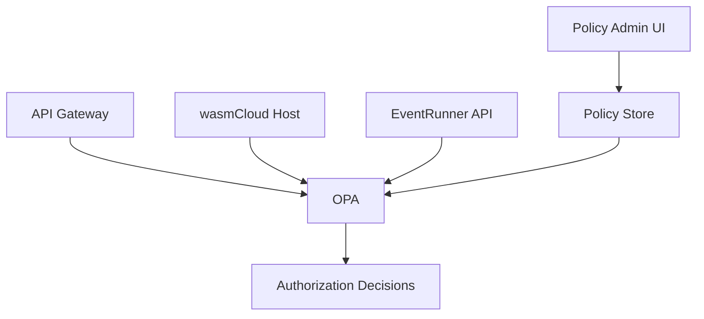

# Open Policy Agent Integration Strategy

## Overview

Integrating Open Policy Agent (OPA) into the EventRunner ecosystem will provide a unified, flexible, and scalable approach to Role-Based Access Control (RBAC) across our API and wasmCloud deployments.

## Benefits

1. **Centralized Policy Management**: Define and manage all access control policies in one place.
2. **Declarative Policies**: Express complex authorization rules using OPA's declarative language, Rego.
3. **wasmCloud Compatibility**: Leverage OPA's integration with wasmCloud for consistent policy enforcement.
4. **Scalability**: OPA's design allows for high-performance policy evaluation at scale.
5. **Flexibility**: Easily adapt and extend policies as the system grows and requirements change.

## Architecture



## Components

### 1. OPA Server

Deploy OPA as a separate service within your Kubernetes cluster.

### 2. Policy Store

Store OPA policies in a version-controlled repository (e.g., Git).

### 3. Policy Sync

Implement a mechanism to sync policies from the store to OPA instances.

### 4. API Integration

Modify your API gateway and services to consult OPA for authorization decisions.

### 5. wasmCloud Integration

Configure wasmCloud to use OPA for policy decisions in actor communications.

### 6. Policy Admin UI

Develop a user interface for administrators to manage OPA policies.

## Implementation Steps

1. **Deploy OPA**:
   ```yaml
   apiVersion: apps/v1
   kind: Deployment
   metadata:
     name: opa
   spec:
     containers:
     - name: opa
       image: openpolicyagent/opa:latest
       ports:
       - containerPort: 8181
   ```

2. **Define Base Policies**:
   Create initial RBAC policies in Rego. Example:
   ```rego
   package eventrunner.authz

   default allow = false

   allow {
     input.role == "admin"
   }

   allow {
     input.role == "user"
     input.method == "GET"
     input.path == ["api", "v1", "usage"]
   }
   ```

3. **Integrate with API Gateway**:
   Modify your API gateway (e.g., Nginx, Traefik) to query OPA before routing requests.

4. **Update EventRunner API**:
   Modify your API to include OPA checks. Example in Go:
   ```go
   func authorizeRequest(r *http.Request) bool {
     client := opa.New("http://opa-server:8181")
     input := map[string]interface{}{
       "method": r.Method,
       "path":   strings.Split(r.URL.Path, "/"),
       "role":   extractRole(r),
     }
     allow, err := client.Query("data.eventrunner.authz.allow", input)
     return err == nil && allow.(bool)
   }
   ```

5. **Configure wasmCloud**:
   Update wasmCloud host configuration to use OPA for actor-to-actor communication authorization.

6. **Develop Policy Admin UI**:
   Create a web interface for managing OPA policies, possibly integrated into your existing admin portal.

## Example Policies

### API Access Control
```rego
package eventrunner.api

default allow = false

allow {
  input.method == "GET"
  input.path = ["api", "v1", "usage"]
  has_permission(input.user, "view_usage")
}

has_permission(user, permission) {
  role := user_roles[user]
  permission := role_permissions[role][_]
}

user_roles = {
  "alice": "admin",
  "bob": "user"
}

role_permissions = {
  "admin": ["view_usage", "manage_billing"],
  "user": ["view_usage"]
}
```

### wasmCloud Actor Communication
```rego
package eventrunner.wasmcloud

default allow = false

allow {
  input.source_actor == "billing_actor"
  input.target_actor == "usage_collector"
  input.operation == "get_usage_data"
}
```

## Considerations

1. **Performance**: Monitor OPA's performance impact and optimize if necessary.
2. **Policy Testing**: Implement unit tests for OPA policies to ensure correctness.
3. **Audit Logging**: Configure OPA to log all policy decisions for audit purposes.
4. **Caching**: Consider caching OPA decisions to reduce latency for frequent requests.
5. **Fallback Mechanism**: Implement a fallback authorization mechanism in case OPA is unavailable.

## Next Steps

1. Set up a proof-of-concept OPA deployment in a development environment.
2. Develop initial RBAC policies for your API and wasmCloud actors.
3. Integrate OPA with your API gateway and test thoroughly.
4. Gradually migrate existing authorization logic to OPA policies.
5. Develop and test the Policy Admin UI.
6. Plan for production deployment, including high availability and security considerations.