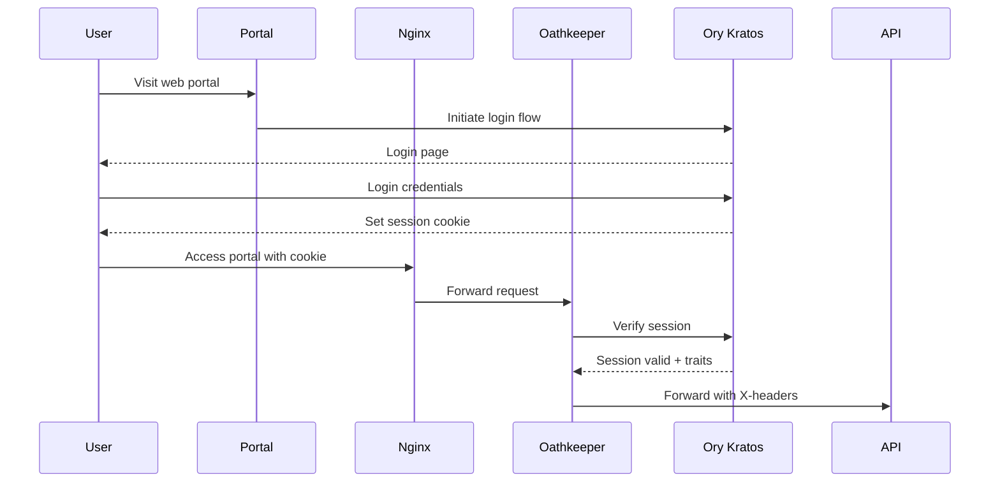
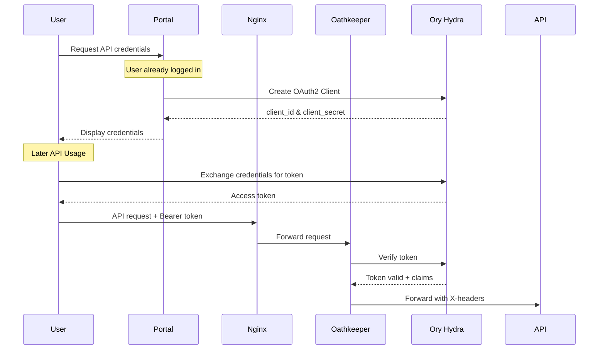

# Auth Server

## Web Portal Flow

```mermaid
sequenceDiagram
    participant User
    participant Portal
    participant Nginx
    participant Oathkeeper
    participant Ory Kratos
    participant API

    User->>Portal: Visit web portal
    Portal->>Ory Kratos: Initiate login flow
    Ory Kratos-->>User: Login page
    User->>Ory Kratos: Login credentials
    Ory Kratos-->>User: Set session cookie
    User->>Nginx: Access portal with cookie
    Nginx->>Oathkeeper: Forward request
    Oathkeeper->>Ory Kratos: Verify session
    Ory Kratos-->>Oathkeeper: Session valid + traits
    Oathkeeper->>API: Forward with X-headers
```

## API Access Flow

```mermaid

sequenceDiagram
participant User
participant Portal
participant Nginx
participant Oathkeeper
participant Ory Hydra
participant API

    User->>Portal: Request API credentials
    Note over Portal: User already logged in
    Portal->>Ory Hydra: Create OAuth2 Client
    Ory Hydra-->>Portal: client_id & client_secret
    Portal-->>User: Display credentials
    
    Note over User: Later API Usage
    User->>Ory Hydra: Exchange credentials for token
    Ory Hydra-->>User: Access token
    User->>Nginx: API request + Bearer token
    Nginx->>Oathkeeper: Forward request
    Oathkeeper->>Ory Hydra: Verify token
    Ory Hydra-->>Oathkeeper: Token valid + claims
    Oathkeeper->>API: Forward with X-headers
```
